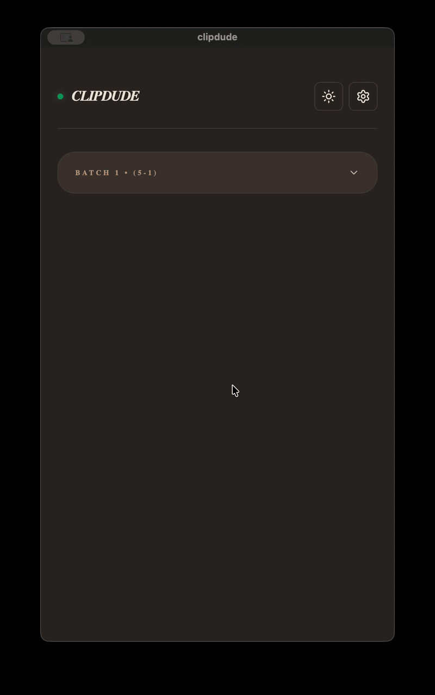

-----

## ClipDude v1.0.4 — Release Notes

ClipDude is now ready for use. This project started because I needed a clipboard manager that was fast and respected my privacy by keeping all data locally. After refining the build process across macOS, Windows, and Linux, the first stable version is now live.

### Official Downloads

All build assets, including installers for Windows (.msi), macOS (.dmg), and Linux (.AppImage/.deb), are available on the repository releases page:
**[Download Assets ⬇](https://github.com/rimu-7/clipdude/releases)**

-----

### Core Philosophy

  * **Local Storage:** ClipDude uses a local SQLite database. Your data never leaves your machine and there is no cloud synchronization.
  * **Minimalist Interface:** The UI is built with a "boxy," non-rounded aesthetic to stay lightweight and functional.
  * **Batch Organization:** History is stored in discrete batches rather than a single, resource-heavy infinite list.
  * **Background Operation:** The app runs from the system tray or menubar, ensuring it monitors your clipboard without needing an active window.

-----

### Clipdude Preview

-----

### Installation Instructions

As an independent developer, I have not yet notarized these binaries with Apple or Microsoft. You will need to follow these steps to bypass the standard security flags:

**macOS Installation**

1.  Download the `.dmg` and move **ClipDude.app** to your **Applications** folder.
2.  If you receive a "damaged file" or "unidentified developer" error, open your Terminal and run:
    `xattr -cr /Applications/clipdude.app`
3.  Launch the app normally.

**Windows Installation**

1.  Run the `.exe` or `.msi` installer.
2.  When the blue SmartScreen window appears, click **More Info** and then select **Run Anyway**.

**Linux Installation**

1.  Download the `.AppImage`.
2.  Make the file executable via your file manager permissions or by running:
    `chmod +x clipdude_0.1.0_amd64.AppImage`

-----
